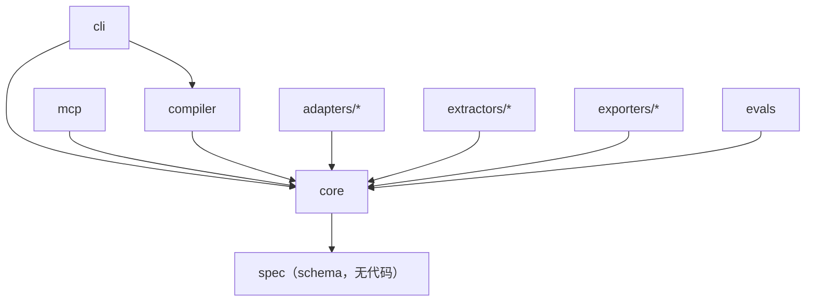

# Citebase 仓库结构与依赖边界

> 状态：M5 实现基线 2026-08-24。内核（lint / 索引 / 检索 / 评测）、编译循环（端口 / 适配器 /
> 抽取器 / 七步管线 / 审核队列 / 留痕）、治理 + MCP（失效信号总线 / 复核 / 裁决 / 脚手架 /
> 只读四工具）、证据回流 + 评测（事件源 / 回流编译器 / 贡献度 / 缺口清单 / 忠实度抽查）、
> 加速 + 导出（IndexBackend 端口 / sqlite 后端 / 站点与 JSON 导出器 / bench 基线）
> 与 Vault 联邦（deps 锁定 / `::` 跨库引用 / 联邦检索 / 依赖过期提示）已全部落地——
> 路线图 M0–M5 的代码里程碑完成；拆分独立发行包在公开后按需评估。

## 当前实际结构

```text
Citebase/
├─ README.md               # 项目门面：定位、支柱、快速开始、导航、路线图速览
├─ PROJECT_STRUCTURE.md    # 本文
├─ LICENSE                 # Apache-2.0（随 M2 落地）
├─ pyproject.toml          # 包定义：core/ 布局、vault / vault-mcp 入口、pytest/ruff/mypy 配置
├─ spec/                   # JSON Schema v0.1：card / evidence-event / pack（契约事实源）
├─ core/citebase/         # 单一发行包 citebase（spec 打包副本随包分发）
│  ├─ model / frontmatter / spanhash / vault      # 对象模型与事实源加载
│  ├─ lint / index / retrieve / evalrun / cli     # M0：治理规则、索引、检索漏斗、评测
│  │                       #   （evalrun 含 M3 忠实度抽查：哈希通道 + 人工核对清单）
│  ├─ ports.py             # 六边形端口：SourceAdapter / Extractor / LlmProvider
│  ├─ ingest.py / audit.py # L0 源登记（无 LLM）与 _audit append-only 台账
│  ├─ drift.py / govern.py # M2：失效信号总线（双通道漂移 + 时效）与人工治理动词
│  ├─ security.py          # 编译期注入扫描（L-SEC-1；规则库版本化）
│  ├─ scaffold.py          # vault init：空 vault + generic 包 + CI 即治理模板
│  ├─ evidence.py          # M3：EvidenceEvent 模型、JSONL 装载、事件登记为不可变源
│  ├─ contrib.py           # M3：知识贡献度榜单（可复算；负贡献进复核候选）
│  ├─ retrievelog.py       # M3：匿名化检索日志 + 知识缺口清单（log + golden 合并）
│  ├─ bench.py             # M4：检索性能基线（合成 N 卡、双后端 P50/P95）
│  ├─ federation.py        # M5：deps 解析与 vault.lock、跨库引用、联邦检索、过期提示
│  ├─ adapters/            # file / dir（url 按需追加；evidence 语义在 evidence.py）
│  ├─ backends/            # M4：IndexBackend 实现——memory（进程内）/ sqlite（加速缓存），
│  │                       #   对照测试保证两后端检索结果逐分一致
│  ├─ extractors/          # plain / pypdf（可选依赖 citebase[pdf]）
│  ├─ exporters/           # M4：site（静态站点）/ json（确定性产品快照）+ 许可证警示
│  ├─ compiler/            # M1：七步管线、审核队列、_compile_log、prompt 模板、
│  │                       #   scripted 与 OpenAI 兼容两个 LlmProvider（唯一调 LLM 的子包）；
│  │                       #   M3：backflow 回流编译器（确定性，失败聚类 → 陷阱卡草案）
│  └─ mcp/                 # M2：MCP Server 只读四工具（stdio；可选依赖 citebase[mcp]）
├─ examples/
│  ├─ generic-basics/      # 24 卡示例 vault：3 个源、32 条论断全部绑定 span 哈希，
│  │                       #   evals/golden.yaml 22 问（命中率验收线 ≥ 0.8）
│  ├─ federation/          # M5 双库联邦示例：methods-provider（上游）+ consumer
│  │                       #   （path 依赖 + vault.lock 已提交，可复现）
│  └─ citebase-self/       # 自举 vault（dogfooding）：本项目自身的工程知识，
│                          #   概念 / 方法 / 决策 / 陷阱四类卡，接入 CI 三道门
├─ tests/                  # 211 个确定性单测（不依赖 LLM 与网络；LLM 路径用剧本化替身）
├─ .githooks/ + scripts/   # 提交规范钩子（身份与禁入路径校验）及安装、哈希回填脚本
└─ docs/                   # 设计文档（本地维护，不随公开仓库分发；公开知识见自举 vault）
```

落地说明：目标布局中的顶层 `compiler/`、`adapters/`、`extractors/`、`mcp/` 暂以 `citebase.*`
子包形态落在单一发行包内（导入路径与目标布局一致，公开后再评估拆分为独立发行包）；「mcp 不得
import compiler」的铁律当前由导入纪律保证（`citebase.mcp` 只导入 index / retrieve / vault），
拆分发行包后升级为包依赖关系强制。`core/citebase/spec/` 是 `spec/`
的打包副本，由 `test_spec_sync.py` 强制逐字节一致。

## 目标布局（M0 起逐步落地）

```text
citebase/
├─ spec/                     # 三类 JSON Schema：契约事实源，先于代码冻结
├─ core/citebase/           # 对象模型、端口定义、lint、索引、检索漏斗
├─ compiler/                 # 七步编译循环 + 回流编译器（依赖 core + LLM 端口）
├─ mcp/                      # MCP Server：读侧四工具
├─ cli/                      # vault 命令行（治理动词只在这里）
├─ adapters/                 # SourceAdapter 实现：file / dir / git / url / evidence
├─ extractors/               # Extractor 实现：plain / pypdf / mineru / docling
├─ packs/                    # 内置本体包：generic / code / research
├─ exporters/                # site（静态站点）/ json（产品快照）
├─ evals/                    # golden set 框架 + 忠实度评测
├─ examples/                 # ≥2 个完整示例 vault（含自举 vault，见下）
└─ docs/                     # 设计文档与 ADR（本目录随代码同仓演进）
```

## 依赖方向（铁律）



约束：

1. **`core` 位于最底层**：只依赖 `spec` 的 schema 与标准库/pydantic，不依赖任何 LLM SDK、抽取器、数据库驱动。
2. **端口在 core，实现在外围**：`SourceAdapter`、`Extractor`、`LlmProvider`、`IndexBackend` 四个端口由 core 定义；adapters/extractors/加速后端各自实现，运行时装配。
3. **compiler 是唯一会调用 LLM 的包**；core 的 lint/index/search 全程无 LLM（M0 卖点的结构保证）。
4. **mcp 只读**：mcp 包不得 import compiler；治理动词（drift/audit/resolve/compile）只在 cli。这条边界由包依赖关系而非文档约定保证。
5. **内核零领域词**（L-CORE-1）：core 与内置 schema 出现任何领域词汇（数学建模、法律、医疗……）即 lint 失败；领域语义只准住在 `packs/`。
6. **spec 独立演进**：schema 版本与代码版本解耦，破坏性变更必须附迁移脚本（见 `spec/README.md`）。

## 命名约定

| 对象 | 约定 | 示例 |
|---|---|---|
| Python 包 | `citebase.*` 命名空间，模块 `snake_case` | `citebase.core.ports` |
| 卡片文件 | `cards/<kind>/<slug>.md`，slug 用 kebab-case | `cards/methods/grey-forecast-gm11.md` |
| 卡片 id | `card-<kind>-<slug>`，**一经发布永不复用**；改名走 `aliases` | `card-method-gm11` |
| 源 id | `src-<语义化短名>` | `src-2024-mcm-paper-0417` |
| 证据事件 id | `evt-<日期>-<短名>` | `evt-2026-08-14-run-0392` |
| 跨库引用（M5） | `<vault-id>::<card-id>`，`::` 为保留分隔符 | `mathmodel-methods::card-method-gm11` |
| Schema 文件 | `spec/<对象>.schema.json`，`$id` 带版本 | `spec/card.schema.json` |
| ADR | `docs/adr/NNNN-short-title.md`（本地维护，不随公开仓库分发） | `docs/adr/0002-dual-granularity-card-claim.md` |

## 一个 vault 的目录布局（用户侧）

```text
my-vault/
├─ vault.yaml              # 配置：pack、阈值、llm 段（编译端点）、review 段（抽样阶梯）、
│                          #   index_backend（M4）、deps 依赖声明（M5）
├─ vault.lock              # M5：依赖锁定（resolved_rev + 逐卡内容哈希；deps sync 生成，提交）
├─ packs/                  # 本地或引用的本体包
├─ sources/<id>/           # meta.yaml + originals/（原件不动）+ extracted/（派生物）
├─ cards/<kind>/*.md       # 知识卡片：Markdown + YAML frontmatter
├─ refs/                   # references.bib + status.yaml：已验证引用白名单
├─ evidence/*.jsonl        # 执行证据事件（同时也是一种源）
├─ _index/                 # 生成物，勿手改，坏了就重建（index.sqlite 缓存不入库）
├─ _deps/                  # M5：git 依赖的本地克隆缓存（不入库，deps sync 重建）
├─ _review/                # 审核队列：queue.yaml 台账 + drafts/ 待审 + rejected/ 留证
│                          #   + history.yaml（自适应抽样历史）
├─ _audit/                 # AuditRecord，append-only
├─ _compile_log/           # 每次编译/回流运行的模型/成本/产出记录
└─ _logs/                  # 匿名化检索日志（retrieval.jsonl，缺口清单的数据源）
```

`_` 前缀目录 = 机器生成物或 append-only 台账；无 `_` 目录 = 人与编译器共同治理的事实源。

## 示例与自举

`examples/` 包含三个完整示例 vault：

1. **generic-basics**：通用概念/方法/陷阱卡，演示零 LLM 的 M0 工作流；
2. **federation**：双库联邦（path 依赖 + lock），演示 M5 跨库引用；
3. **citebase-self（自举，已落地）**：Citebase 自己的设计与工程知识用 Citebase 管理——项目对自己的机制下注。设计要点、开发事件与发布约定先蒸馏为源笔记（`sources/`），再论断化为卡片，每条论断绑定 span 哈希，与其他示例一样过 lint / index --check / eval 三道 CI 门。
