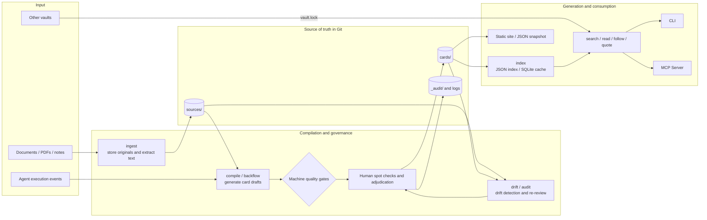

# Citebase

English | [简体中文](./README.zh-CN.md)

> Compile raw material into searchable, verifiable, and governable knowledge cards.

Citebase is a **compile-first knowledge system** for AI agents and team knowledge bases. Rather than re-interpreting the entire corpus every time a question is asked, it organizes documents into structured cards up front, then keeps that knowledge traceable through provenance checks, human spot review, and drift detection.

A card is written for people to read; every claim inside it is bound to a source location and a content hash for machines to verify. The final artifacts are still Markdown and YAML, so they fit straight into a Git workflow with no external database or vector service.

## What problems it solves

- **Repeated comprehension is expensive**: source material is processed once, at compile time; retrieval works directly with the already-distilled conclusions.
- **Answers carry citations that cannot be verified**: citations go down to the claim level, recording the source, its location, and a span hash.
- **Source files change and the knowledge base never notices**: drift detection marks affected cards as `suspect` and drops them from retrieval results by default.
- **Pitfalls agents have already hit are never captured**: execution events can flow back in; after clustering and review they become pitfall cards.
- **Knowledge bases are hard to fold into engineering governance**: cards, configuration, and audit records are all files — reviewable, diffable, and revertible.

## Compared with RAG, GraphRAG, and LLM wikis

Citebase is less concerned with "finding more context for a single question" and more with "compiling raw material into a trusted, maintainable knowledge asset for the long term". Traditional RAG and agentic RAG mainly improve query-time recall and reasoning, while GraphRAG also builds graphs and summaries before queries; **LLM wikis and Citebase both belong to compile-first knowledge production in the broad sense**. The real difference between the two is not whether compilation happens up front, but the contract the compiled artifacts obey and how they are governed afterwards.

| Approach | Primary artifacts | Understanding happens | Good at | Usually not enforced |
|---|---|---|---|---|
| Traditional RAG | Document chunks and vector indexes | At query time | Fast recall of relevant passages from a large corpus | Claim-level provenance, human review, knowledge lifecycle, and execution feedback |
| Agentic RAG | Multi-turn retrieval, tool calls, and dynamic routing | At query time, over multiple steps | Decomposing complex questions, rewriting queries, choosing data sources, and self-verification | Whether the retrieved knowledge itself is governed, up to date, or reviewable in Git |
| GraphRAG | Entity-relation graphs, community summaries, or graph indexes | At graph-build time + query time | Cross-document relations, global themes, and multi-hop questions | Hard binding of each natural-language claim to its source text; lifecycle management after drift |
| LLM wiki / AI doc generation | Human-readable pages, sections, and navigation | Generated before queries, regenerated after sources change | Quickly understanding a codebase or corpus through coherent, browsable explanations | Rarely defines each claim as an independent data object with a lifecycle; review, drift, and execution feedback depend on the product |
| **Citebase** | Markdown cards, structured claims, provenance, and audit records | **Compiled before queries, continuously re-checked afterwards** | **Claim-level verification, Git governance, staleness detection, agent reuse, and experience backflow** | Does not primarily aim to auto-generate full encyclopedia narratives or instantly answer arbitrary questions over raw corpora |

The most important difference is the unit of knowledge:

- The basic unit in RAG is usually the **chunk**. A citation can tell you which chunk an answer drew on, but not necessarily prove which source passage supports a specific sentence.
- The basic units in GraphRAG are usually **entities, relations, and community summaries** — good for discovering connections, though whether every conclusion in the graph can be verified item by item depends on the implementation.
- An LLM wiki also digests material ahead of time, but its main unit of delivery is usually the **page**: the goal is a coherent, browsable explanation, with claims mostly embedded in the page's narrative.
- Citebase keeps both **cards** and **claims**: cards handle reading and retrieval, while claims handle provenance binding, hash verification, state transitions, and contradiction resolution.

So Citebase does not draw the line against LLM wikis at "being compiled". It tightens the compiled output from **generated pages** into **schema-constrained knowledge objects that can be verified claim by claim and governed over time**. A page can be regenerated wholesale; Citebase instead records each claim's origin, status, contradictions, and audit history.

These approaches are not mutually exclusive. Citebase can serve as the trusted upstream knowledge layer for traditional RAG or GraphRAG, or supply governed page material to an LLM wiki: compile the raw sources into cards first, then run vector retrieval, graph retrieval, agentic orchestration, or page generation on top of the cards. The trade-off is that writes require compilation and review, so it suits knowledge that needs long-term reuse and accountability — not "dump in a pile of temporary files and start asking questions right away".

## Key features

- Markdown cards with YAML frontmatter — readable by people, parseable by machines
- Claim-level provenance with SHA-256 span verification
- LLM-free lint, index, search, quote verification, and evaluation
- Knowledge compilation driven by any OpenAI-compatible API
- Machine quality gates plus adaptive human spot checks
- Progressive retrieval: `search → read → follow → quote`
- Read-only MCP server for easy agent integration
- Source drift, freshness expiry, contradiction resolution, and audit trails
- Execution evidence backflow, knowledge contribution scoring, and gap analysis
- In-memory / SQLite retrieval backends, plus static site / JSON export
- Vault dependency locking and cross-vault retrieval

## Quick start

Requires Python 3.12+. [uv](https://docs.astral.sh/uv/) is recommended.

```bash
uv venv --python 3.12
uv pip install --python .venv/bin/python -e ".[dev]"
```

On Windows, replace `.venv/bin/python` in the install command with `.venv\Scripts\python.exe`. Then activate the virtual environment:

```bash
# Linux / macOS
source .venv/bin/activate

# Windows PowerShell
.venv\Scripts\Activate.ps1
```

The repository ships with a 24-card example vault (its content is written in Chinese, which is why the sample query below is too). None of the following commands calls an LLM:

```bash
vault lint --vault examples/generic-basics
vault index --vault examples/generic-basics
vault search "缓存 同时失效" --vault examples/generic-basics
vault read card-pitfall-cache-avalanche --vault examples/generic-basics
vault quote "card-concept-idempotency#c1" --vault examples/generic-basics
vault eval --vault examples/generic-basics --min-hit 0.8 --min-first 0.8
```

In order, these commands take you through structure and provenance checks, index building, search, card reading, source verification, and golden-set evaluation. `quote` returns the claim, its source span, and the hash-verification result.

## How it works



Three boundaries matter in this architecture:

1. **Raw material is a source, not a retrieval result**: `ingest` stores originals and derived text; only `compile` turns them into cards.
2. **Cards are the source of truth; indexes are build artifacts**: `cards/` belongs in version control, `_index/` can be rebuilt at any time, and SQLite serves only as a local acceleration cache.
3. **Machines propose and block; humans adjudicate**: claims without provenance are rejected by the quality gates; contradictions, merge candidates, and suspect cards go into the human workflow.

### How a claim is verified

```text
Card
└─ Claim
   ├─ text: the structured claim
   └─ sources[]
      ├─ source: source ID
      ├─ loc: location in the source text
      └─ span_sha256: hash of the referenced span
```

`vault quote <card-id>#<claim-id>` re-reads the source text at that location and recomputes the hash, so a modified source span never passes silently.

## Creating your own vault

Generate the directory skeleton first:

```bash
vault init my-vault --name my-vault
```

Register material and compile:

```bash
vault ingest notes.md --vault my-vault
vault compile --vault my-vault
vault review list --vault my-vault
```

`ingest` itself never calls an LLM. By default `compile` reads the OpenAI-compatible settings from `vault.yaml`, with the API key supplied through the `CITEBASE_API_KEY` environment variable; for tests or offline demos, `--scripted answers.yaml` reads scripted responses instead.

Review the drafts:

```bash
vault review show card-example --vault my-vault
vault review approve card-example --by alice --vault my-vault
vault review reject card-example --reason "出处不足" --vault my-vault
```

Drafts from a new source all go to review by default; once a source builds up a stable pass rate, the sampling ratio for its ordinary drafts gradually decreases. Merge candidates and contradiction cards always require human handling.

## Retrieval protocol

Citebase splits retrieval into four read-only actions instead of returning the whole vault at once:

- `search`: returns candidate cards with summaries.
- `read`: reads a selected card's body, claims, and links.
- `follow`: hops to adjacent cards along controlled relations.
- `quote`: fetches the source span behind a claim and verifies its hash.

By default, retrieval excludes `suspect`, `superseded`, and `retired` cards. When nothing matches, it returns an explicit degradation message instead of passing the model's own knowledge off as vault content.

## MCP integration

Install the optional MCP dependencies:

```bash
uv pip install --python .venv/bin/python -e ".[mcp]"
```

On Windows, use `.venv\Scripts\python.exe` here as well. Then add this to any MCP-capable host:

```json
{
  "mcpServers": {
    "citebase": {
      "command": "/absolute/path/to/vault-mcp",
      "args": ["--vault", "/absolute/path/to/my-vault"]
    }
  }
}
```

On Windows the executable usually lives at `.venv\Scripts\vault-mcp.exe`. MCP exposes only `knowledge_search`, `knowledge_read`, `knowledge_follow`, and `knowledge_quote`; compilation, review, and adjudication stay in the CLI.

## Governance and feedback

### Drift and re-review

```bash
vault drift --vault my-vault
vault audit list --vault my-vault
vault audit review card-example --outcome pass --by alice --vault my-vault
```

`drift` aggregates source revision changes, span-hash mismatches, and freshness-expiry signals. It only marks cards as `suspect`; it never rewrites or deletes knowledge on its own.

### Contradiction resolution

```bash
vault resolve card-contradiction-example --winner c1 --by alice --vault my-vault
```

The compiler can detect and record contradictions, but it does not automatically decide which side is correct.

### Execution evidence backflow

External agents can write `evidence/*.jsonl` following [`spec/evidence-event.schema.json`](./spec/evidence-event.schema.json), then run:

```bash
vault backflow --vault my-vault
vault contrib --vault my-vault
vault gaps --vault my-vault
```

`backflow` drafts a pitfall card only after failures of the same kind reach a threshold, and every draft must still pass review. `contrib` compares task success rates with and without a given card, and `gaps` aggregates the misses from retrieval and evaluation.

## Export and federation

```bash
# Export a site for people and a snapshot for programs
vault export site --out dist/site --vault my-vault
vault export json --out dist/snapshot.json --vault my-vault

# Sync the knowledge dependencies declared in vault.yaml and check the lock file
vault deps sync --vault my-vault
vault deps status --vault my-vault
```

Vault federation pins dependency versions with `vault.lock`. Cross-vault cards are identified as `<vault-id>::<card-id>`, and upgrading a dependency is an explicit lock-file change — upstream content never propagates silently.

See [`examples/federation/`](./examples/federation/) for an example federation setup.

## Repository layout

```text
core/citebase/              Python package and CLI
├─ adapters/                 File source adapters
├─ backends/                 In-memory and SQLite retrieval backends
├─ compiler/                 Compilation, review, and evidence backflow
├─ exporters/                Static site and JSON exporters
├─ extractors/               Text and PDF extraction
└─ mcp/                      Read-only MCP server

spec/                        JSON Schemas for cards, packs, and execution events
examples/generic-basics/     Single-vault starter example
examples/federation/         Cross-vault dependency example
docs/                        Architecture, governance, security, and ADRs
tests/                       Test suite
```

The main directories inside a vault:

```text
my-vault/
├─ vault.yaml                Vault configuration
├─ cards/                    Approved knowledge cards (source of truth)
├─ sources/                  Originals, derived text, and source metadata
├─ packs/                    Card types, relations, and tag vocabularies
├─ evidence/                 Agent execution events
├─ evals/                    Golden sets
├─ _review/                  Pending and rejected drafts
├─ _audit/                   Append-only audit records
├─ _compile_log/             Compile run records
└─ _index/                   Rebuildable indexes
```

## Development

```bash
python -m pytest tests -q
python -m ruff check .
python -m mypy
```

Before committing code, at minimum make sure the example vault passes lint, index consistency, and evaluation. See `vault --help` or `vault <command> --help` for the full command reference.

## Further reading

- [Architecture overview](./docs/architecture/system-overview.md) (Chinese)
- [Object model](./docs/architecture/object-model.md) (Chinese)
- [Compile pipeline](./docs/architecture/compile-pipeline.md) (Chinese)
- [Retrieval protocol](./docs/architecture/retrieval-protocol.md) (Chinese)
- [Storage and versioning](./docs/architecture/storage-and-versioning.md) (Chinese)
- [Provenance and drift governance](./docs/governance/provenance-and-drift.md) (Chinese)
- [Quality gates](./docs/governance/quality-gates.md) (Chinese)
- [Threat model](./docs/security/threat-model.md) (Chinese)
- [Architecture decision records](./docs/adr/) (Chinese)

## License

[Apache License 2.0](./LICENSE)
