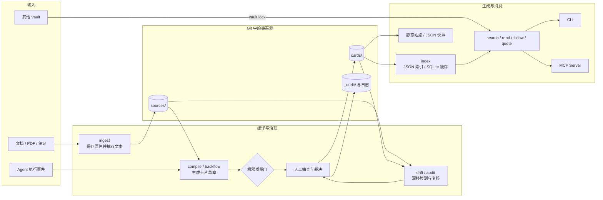

# Citebase

[English](./README.md) | 简体中文

> 把原始资料编译成可检索、可验证、可治理的知识卡片。

Citebase 是一个面向 AI Agent 和团队知识库的**编译式知识系统**。它不在每次提问时重新理解整批原始资料，而是先把文档整理为结构化卡片，再通过出处校验、人工抽查和漂移检测保证知识可追溯。

一张卡片供人阅读；卡片里的每条论断都绑定原文位置和内容哈希，供机器核验。最终内容仍是 Markdown 和 YAML，可以直接进入 Git 工作流，不依赖外部数据库或向量服务。

## 它解决什么问题

- **重复理解成本高**：资料只在编译阶段集中处理，检索阶段直接使用已整理的结论。
- **答案有引用但不可核验**：引用下沉到论断级，记录源、位置和片段哈希。
- **源文件变了，知识库不知情**：漂移检测会把受影响卡片标记为 `suspect`，并默认移出检索结果。
- **Agent 踩过的坑无法沉淀**：执行事件可以回流，经聚类和审核后形成陷阱卡。
- **知识库难以纳入工程治理**：卡片、配置和审计记录都是文件，可审查、可 diff、可回滚。

## 与 RAG、GraphRAG 和 LLM Wiki 的区别

Citebase 关注的不是“如何在一次问答里找到更多上下文”，而是“如何把原始资料长期编译成可信、可维护的知识资产”。传统 RAG 和 Agentic RAG 主要改进查询时的召回与推理，GraphRAG 还会在查询前构建图和摘要；**LLM Wiki 与 Citebase 都属于广义的编译式知识生产**。两者真正的区别不在于是否预先编译，而在于编译产物的契约与后续治理方式。

| 方案 | 主要产物 | 理解发生在 | 擅长解决 | 通常没有强制解决 |
|---|---|---|---|---|
| 传统 RAG | 文档切块与向量索引 | 查询时 | 从大规模原文中快速召回相关片段 | 论断级出处、人工审核、知识生命周期和执行反馈 |
| Agentic RAG | 多轮检索、工具调用与动态路由过程 | 查询时，多步进行 | 复杂问题拆解、改写查询、选择数据源和自我校验 | 被检索知识本身是否已治理、是否过期、能否进入 Git 审查 |
| GraphRAG | 实体关系图、社区摘要或图索引 | 建图时 + 查询时 | 跨文档关系、全局主题和多跳关联问题 | 每条自然语言论断的原文硬绑定、漂移后的生命周期管理 |
| LLM Wiki / AI 文档生成 | 面向人阅读的页面、章节与导航 | 查询前生成，源变化后再生成 | 快速理解代码库或资料集，形成连贯、可浏览的知识说明 | 通常不把每条论断定义为带生命周期的独立数据对象；审核、漂移和执行反馈取决于具体产品 |
| **Citebase** | Markdown 卡片、结构化论断、出处与审计记录 | **查询前编译，之后持续复核** | **论断级验证、Git 治理、失效检测、Agent 复用和经验回流** | 不以自动生成完整百科叙事或即时回答任意原始语料问题为首要目标 |

最关键的差异是知识单元：

- RAG 的基本单元通常是**切块**，引用能说明“答案参考了哪一块”，但不一定能证明“这句话由哪段原文支持”。
- GraphRAG 的基本单元通常是**实体、关系和社区摘要**，适合发现联系，但图中结论是否可逐条核验取决于具体实现。
- LLM Wiki 也会预先理解资料，但其主要交付单元通常是**页面**：目标是形成连贯、易浏览的解释，论断多半嵌在页面叙述中。
- Citebase 同时保留**卡片**和**论断**：卡片负责阅读与检索，论断负责出处绑定、哈希核验、状态流转和矛盾裁决。

因此 Citebase 不是用“编译式”与 LLM Wiki 划界，而是把编译结果从**生成页面**进一步收紧为**受 schema 约束、可逐条验证和持续治理的知识对象**。页面可以整体重生成；Citebase 则记录具体论断的来源、状态、矛盾和审计历史。

这些方案并不互斥。Citebase 可以作为传统 RAG 或 GraphRAG 的上游可信知识层，也可以为 LLM Wiki 提供经过治理的页面素材：先把原始资料编译为卡片，再对卡片做向量检索、图检索、Agentic 调度或页面生成。代价是写入前需要编译和审核，因此它更适合需要长期复用、可追责的知识，而不是只追求“把一批临时文件立刻问起来”。

## 核心特性

- Markdown 卡片 + YAML frontmatter，人可读、机器可解析
- 论断级出处与 SHA-256 片段校验
- 无 LLM 的 lint、索引、检索、引用核验和评测
- OpenAI 兼容接口驱动的知识编译
- 机器质量门 + 自适应人工抽查
- `search → read → follow → quote` 渐进式检索
- 只读 MCP Server，方便 Agent 接入
- 源漂移、时效过期、矛盾裁决和审计留痕
- 执行证据回流、知识贡献度和缺口分析
- 内存 / SQLite 检索后端，以及静态站点 / JSON 导出
- Vault 依赖锁定与跨库检索

## 快速开始

要求 Python 3.12+。推荐使用 [uv](https://docs.astral.sh/uv/)。

```bash
uv venv --python 3.12
uv pip install --python .venv/bin/python -e ".[dev]"
```

Windows 下把安装命令中的 `.venv/bin/python` 换成 `.venv\Scripts\python.exe`。然后激活虚拟环境：

```bash
# Linux / macOS
source .venv/bin/activate

# Windows PowerShell
.venv\Scripts\Activate.ps1
```

仓库自带一个 24 张卡片的示例库。下面这组命令不调用 LLM：

```bash
vault lint --vault examples/generic-basics
vault index --vault examples/generic-basics
vault search "缓存 同时失效" --vault examples/generic-basics
vault read card-pitfall-cache-avalanche --vault examples/generic-basics
vault quote "card-concept-idempotency#c1" --vault examples/generic-basics
vault eval --vault examples/generic-basics --min-hit 0.8 --min-first 0.8
```

你会依次完成结构与出处检查、索引构建、检索、卡片读取、原文核验和 golden set 评测。`quote` 会返回论断、源片段及哈希核验结果。

## 工作原理



这套架构有三个关键边界：

1. **原始资料是来源，不是检索结果**：`ingest` 保存原件和派生文本，`compile` 才把它们变成卡片。
2. **卡片是事实源，索引是生成物**：`cards/` 应进入版本控制；`_index/` 可以随时重建，SQLite 只作为本地加速缓存。
3. **机器只提出和拦截，人负责裁决**：无出处论断会被质量门拒绝；矛盾、合并候选和可疑卡片进入人工流程。

### 一条论断如何被验证

```text
Card
└─ Claim
   ├─ text: 结构化论断
   └─ sources[]
      ├─ source: 源 ID
      ├─ loc: 原文位置
      └─ span_sha256: 对应片段哈希
```

`vault quote <card-id>#<claim-id>` 会重新读取该位置的原文并计算哈希，因此源片段被修改后不会静默通过。

## 创建自己的 Vault

先生成目录骨架：

```bash
vault init my-vault --name my-vault
```

登记资料并编译：

```bash
vault ingest notes.md --vault my-vault
vault compile --vault my-vault
vault review list --vault my-vault
```

`ingest` 本身不调用 LLM。`compile` 默认读取 `vault.yaml` 中的 OpenAI 兼容配置，密钥通过 `CITEBASE_API_KEY` 环境变量传入；测试或离线演示也可以通过 `--scripted answers.yaml` 读取脚本化应答。

审核草案：

```bash
vault review show card-example --vault my-vault
vault review approve card-example --by alice --vault my-vault
vault review reject card-example --reason "出处不足" --vault my-vault
```

新来源默认全部送审；来源的历史通过率稳定后，普通草案的抽查比例会逐步降低。并卡候选和矛盾卡始终需要人工处理。

## 检索协议

Citebase 把检索拆成四个只读动作，避免一次返回整库内容：

- `search`：返回候选卡片及摘要。
- `read`：读取选中卡片的正文、论断和链接。
- `follow`：沿受控关系跳转到相邻卡片。
- `quote`：取得某条论断对应的原文片段并核验哈希。

默认检索会排除 `suspect`、`superseded` 和 `retired` 卡片。没有命中时返回明确的降级信息，不把模型自身知识伪装成库内结果。

## 接入 MCP

安装 MCP 可选依赖：

```bash
uv pip install --python .venv/bin/python -e ".[mcp]"
```

Windows 同样使用 `.venv\Scripts\python.exe`。在支持 MCP 的宿主中添加：

```json
{
  "mcpServers": {
    "citebase": {
      "command": "/absolute/path/to/vault-mcp",
      "args": ["--vault", "/absolute/path/to/my-vault"]
    }
  }
}
```

Windows 的可执行文件通常位于 `.venv\Scripts\vault-mcp.exe`。MCP 只暴露 `knowledge_search`、`knowledge_read`、`knowledge_follow` 和 `knowledge_quote`；编译、审核和裁决仍由 CLI 完成。

## 治理与反馈

### 漂移和复核

```bash
vault drift --vault my-vault
vault audit list --vault my-vault
vault audit review card-example --outcome pass --by alice --vault my-vault
```

`drift` 汇总源修订变化、片段哈希失配和时效过期信号。它只会把卡片置为 `suspect`，不会自行改写或删除知识。

### 矛盾裁决

```bash
vault resolve card-contradiction-example --winner c1 --by alice --vault my-vault
```

编译器可以发现并记录矛盾，但不会自动决定哪一方正确。

### 执行证据回流

外部 Agent 可以按 [`spec/evidence-event.schema.json`](./spec/evidence-event.schema.json) 写入 `evidence/*.jsonl`，再运行：

```bash
vault backflow --vault my-vault
vault contrib --vault my-vault
vault gaps --vault my-vault
```

`backflow` 只有在同类失败达到阈值后才生成陷阱卡草案，且草案必须经过审核。`contrib` 比较使用某张卡片与未使用时的任务成功率，`gaps` 汇总检索和评测中的未命中项。

## 导出与联邦

```bash
# 导出给人阅读的站点和给程序使用的快照
vault export site --out dist/site --vault my-vault
vault export json --out dist/snapshot.json --vault my-vault

# 同步 vault.yaml 中声明的知识依赖并检查锁文件
vault deps sync --vault my-vault
vault deps status --vault my-vault
```

Vault 联邦通过 `vault.lock` 固定依赖版本。跨库卡片使用 `<vault-id>::<card-id>` 标识，升级依赖是一次显式的锁文件变更，不会静默传播上游内容。

联邦示例配置见 [`examples/federation/`](./examples/federation/)。

## 仓库结构

```text
core/citebase/              Python 包与 CLI
├─ adapters/                 文件来源适配器
├─ backends/                 内存与 SQLite 检索后端
├─ compiler/                 编译、审核与证据回流
├─ exporters/                静态站点与 JSON 导出
├─ extractors/               文本与 PDF 抽取
└─ mcp/                      只读 MCP Server

spec/                        卡片、Pack、执行事件的 JSON Schema
examples/generic-basics/     单库入门示例
examples/federation/         跨库依赖示例
docs/                        架构、治理、安全与 ADR
tests/                       测试套件
```

一个 Vault 的主要目录如下：

```text
my-vault/
├─ vault.yaml                Vault 配置
├─ cards/                    已批准的知识卡片（事实源）
├─ sources/                  原件、派生文本和来源元数据
├─ packs/                    卡片类型、关系和标签词表
├─ evidence/                 Agent 执行事件
├─ evals/                    golden set
├─ _review/                  待审与驳回草案
├─ _audit/                   追加式审计记录
├─ _compile_log/             编译运行记录
└─ _index/                   可重建索引
```

## 开发

```bash
python -m pytest tests -q
python -m ruff check .
python -m mypy
```

提交代码前，至少确保示例 Vault 的 lint、索引一致性和评测通过。完整命令可以通过 `vault --help` 或 `vault <command> --help` 查看。

## 深入阅读

- [架构总览](./docs/architecture/system-overview.md)
- [对象模型](./docs/architecture/object-model.md)
- [编译管线](./docs/architecture/compile-pipeline.md)
- [检索协议](./docs/architecture/retrieval-protocol.md)
- [存储与版本化](./docs/architecture/storage-and-versioning.md)
- [出处与漂移治理](./docs/governance/provenance-and-drift.md)
- [质量门](./docs/governance/quality-gates.md)
- [威胁模型](./docs/security/threat-model.md)
- [架构决策记录](./docs/adr/)

## License

[Apache License 2.0](./LICENSE)
