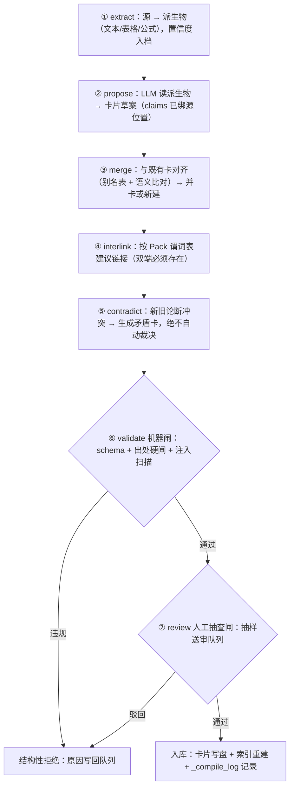

# 编译管线

> 状态：设计 · 基线 2026-08-21
> 编译器 = LLM + 校验器 + 人工抽查闸。知识是编译产物；编译对待知识，要像构建系统对待二进制一样严肃——**增量、留痕、可复现**。

## 1. 七步编译循环



### 每步契约

| 步骤 | 输入 | 输出 | 失败语义 |
|---|---|---|---|
| extract | Source 原件 | `extracted/` 派生物 + confidence | 解析失败：源标记 unextractable，不进后续步骤 |
| propose | 派生物 | 卡片草案（frontmatter + 正文 + claims） | LLM 不可用：整批跳过，可离线重跑 |
| merge | 草案 + 既有卡 | 并卡 diff 或新建；**禁止静默覆盖** | 无法判定：升级为人工审核项 |
| interlink | 草案 + 链接图 | 谓词受控的链接建议 | 谓词越界 / 端点缺失：建议被丢弃并记录 |
| contradict | 草案 claims + 库内 claims | 矛盾卡（contested） | —— 冲突不是失败，是一等公民产物 |
| validate | 全部草案 | 通过集 / 拒绝集 + 违规原因 | 见[质量门](../governance/quality-gates.md)规则清单 |
| review | 抽样草案 | 人工通过 / 驳回 + 留痕 | 驳回原因回流为 prompt 改进线索 |

## 2. 增量编译

- 只处理 `changed_since(verified_revision)` 报告的变更源；无法判断变更的源按「已变更」处理（宁可多审）；
- 并卡（merge）以**别名表精确对齐优先**，语义比对只作候选提示——降低误并；
- 编译批的粒度是「源」，一个源失败不阻塞其他源。

## 3. 抽样闸的自适应

人工抽查率随「该来源历史通过率」自适应：

| 来源状态 | 抽样率 |
|---|---|
| 新源（无历史） | 100% |
| 连续两批通过率 ≥ 90% | 降档（50% → 25% → 10%） |
| 任一批驳回率 > 30% | 回到 100%，并触发 R1 风险预案（见[路线图 §风险](../product/roadmap.md)） |

**全自动无人工不是目标**：人工抽查闸是特性不是耻辱，全自动编译的质量上限就是幻觉率。

## 4. 编译留痕与可复现回放（v0.2 新增）

每次编译运行在 `_compile_log/` 记录一条 run manifest：

```yaml
run_id: compile-2026-08-21-001
inputs:
  sources: [{id: src-2024-mcm-paper-0417, revision: "sha256:ab34…"}]
model: {provider: openai-compatible, name: gpt-x, temperature: 0}
prompts: {propose: propose.v3.prompt.md#sha256:11aa…, merge: merge.v2.prompt.md#sha256:22bb…}
pack_versions: [mathmodel@0.1.0]
cost: {input_tokens: 51200, output_tokens: 8400}
outputs: {cards_new: 7, cards_merged: 2, contradictions: 1, rejected: 3}
```

在此之上提供**回放**：

- `vault compile --replay <run_id>`：以同一输入修订、同一 prompt 版本重跑，输出与原运行的**结构化 diff**（新增/丢失/变更的卡与论断）；
- 用途：模型或 prompt 升级前的回归对照（「新编译器还能编出同样的知识吗」）、质量事故的事后归因；
- 诚实声明：LLM 输出非严格确定，回放目标是**语义等价对照**而非逐字节一致；逐字节红线只适用于索引（`vault index --check`）。

〔组合实践〕借鉴构建系统（可复现构建）思想移植到知识编译，竞品未见同等设计。

## 5. 回流编译器（L1 的特化管线）

消费 `evidence/*.jsonl` 的执行证据事件（schema 见 [`spec/evidence-event.schema.json`](../../spec/evidence-event.schema.json)）：

1. **失败聚类**：按 `failure.category` 与被用卡聚类，达到阈值（默认 ≥2 次同类失败）才提卡——单次失败先记台账不成卡，防噪声；
2. **提议陷阱卡**：现象 / 根因假设 / 规避三节，claims 绑定事件源（`loc` 指向 JSONL 行）；
3. **建链**：与被用卡建立 `pitfall` / `refines` 链接；
4. **同一套两道闸**：机器闸 + 人工抽查闸，**回流不豁免治理**——这是防「恶意 Agent 借回流投毒」的第一道结构防线（另见[威胁模型](../security/threat-model.md)）。

## 6. Token 成本控制

| 手段 | 说明 |
|---|---|
| 增量编译 | 只为变更源付费 |
| 两级模型 | 小模型初筛派生物相关性，大模型只精编入选区段 |
| 离线批处理 | 编译不在查询路径上，可用低价批处理 API |
| 成本透明 | 每次运行的 token 成本进 `_compile_log`，超预算 2 倍触发 R5 预案 |

## 7. 与治理层的接口

编译管线不拥有治理决策，只生产候选与信号：

- validate 调用的是[质量门](../governance/quality-gates.md)统一规则清单（同一套规则同时服务 CI）；
- contradict 产物进[矛盾台账](../governance/provenance-and-drift.md)；
- 编译发现的源漂移（span 哈希失配）投递到失效信号总线，而不是就地改卡。
