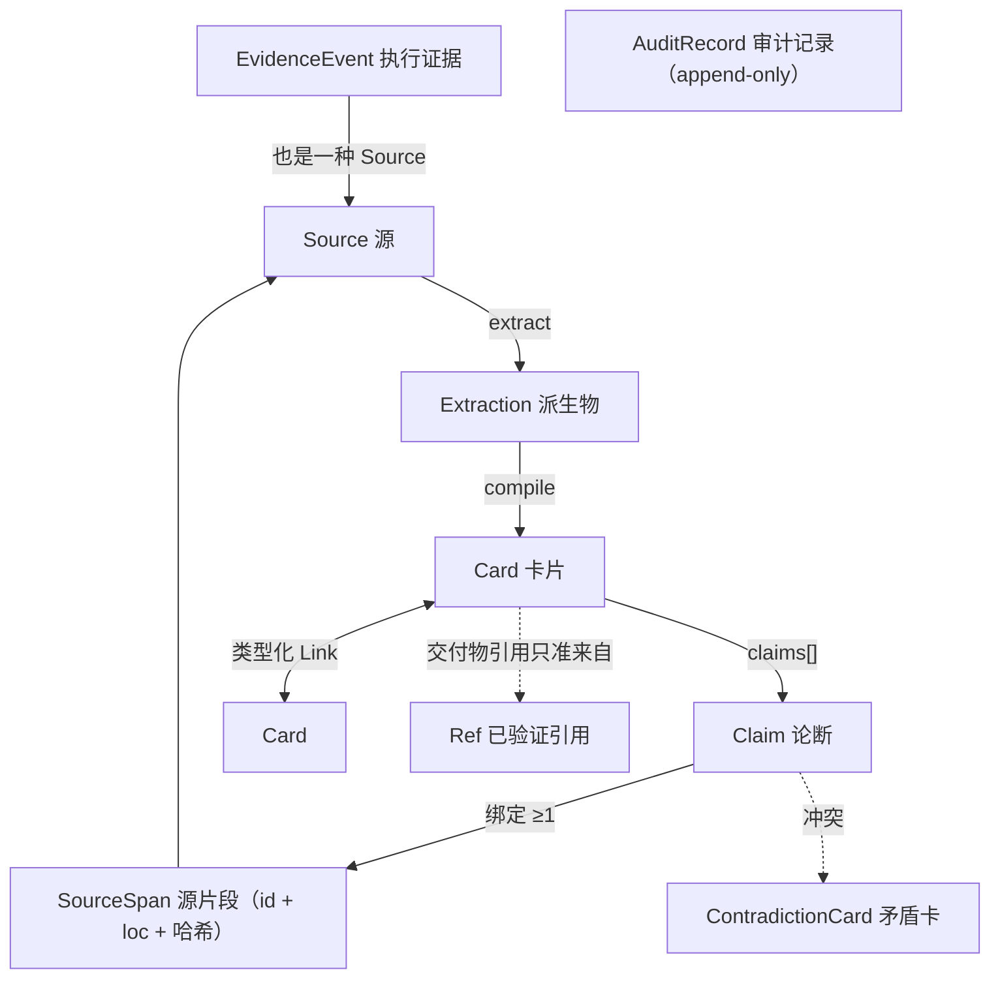
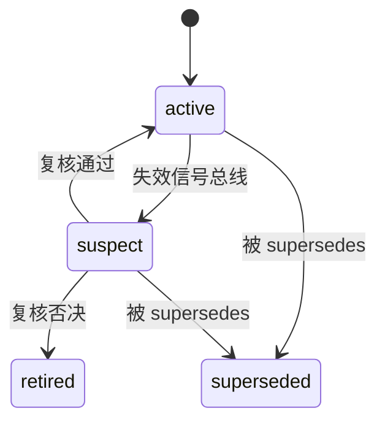

# 对象模型

> 状态：设计 · 基线 2026-08-21 · 对应 schema 草案见 [`spec/`](../../spec/README.md)
> 核心分水岭：**卡片是读取单元，论断是验证单元**——双粒度合一（[ADR-0002](../adr/0002-dual-granularity-card-claim.md)）。

## 1. 对象总览



内核只认识 `Source / Card / Claim / Link` 四个抽象与内置的 `contradiction` 卡类；其余语义全部来自 Ontology Pack（§10）。

## 2. Source（源）

任何「有修订号、能检测变更、能取内容」的东西。

```yaml
# sources/<source_id>/meta.yaml
id: src-2024-mcm-paper-0417
adapter: file            # file | dir | git | url | evidence | 自定义
uri: originals/2024-MCM-C-outstanding-0417.pdf
revision: sha256:ab34…   # 文件哈希 / git commit / HTTP ETag / 事件 id
fetched_at: 2026-08-20T09:00:00Z
extractions:
  - path: extracted/text.md      # 派生物；原件永远不动
    extractor: mineru@2.1        # 抽取器与版本入档（可追责）
    confidence: 0.98             # 解析置信度；低置信不得支撑论断
license: unknown                 # 源许可证登记，导出时联动提示
```

规则：

1. **原件不动、派生另存**：编译层只消费 `extracted/` 派生物，原件是最终仲裁依据；
2. `revision` 必须可比较相等性；`changed_since` 允许返回「无法判断」（此时按变更处理，宁可多审）；
3. 抽取置信度 < 0.6 的派生区段支撑论断时必须带 `low_confidence` 旗标（L-PROV-4）。

## 3. Card（卡片）

人与 Agent 的阅读单元：Markdown 文件 + YAML frontmatter，正文分节由 Pack 定义（如 method 卡固定五节：是什么 / 何时用 / 怎么用 / 边界与陷阱 / 关联）。

```yaml
# cards/methods/grey-forecast-gm11.md 的 frontmatter
id: card-method-gm11
kind: method                  # 受控词表，由 Ontology Pack 定义
name: 灰色预测 GM(1,1)
summary: 面向 4–10 点小样本单调趋势的一阶灰色预测模型   # v0.2 新增：检索命中列表的唯一正文披露（≤80 字）
aliases: [GM11, grey forecast, 灰色模型]
tags: [时间序列, 小样本]
links:
  - {predicate: used_in, to: card-problem-2024-mcm-c}
  - {predicate: pitfall, to: card-pitfall-gm11-short-series}
claims:
  - id: c1
    text: 样本量 4–10 时 GM(1,1) 相对误差通常优于 ARIMA
    sources: [{source: src-2024-mcm-paper-0417, loc: "extracted/text.md#L210-L218", span_sha256: "9f2c…"}]
    confidence: 0.8
    valid_from: null
    valid_until: null
version: 3
status: active                # active | suspect | superseded | retired
verified_against:
  - {source: src-2024-mcm-paper-0417, revision: "sha256:ab34…", at: "2026-08-20"}
```

**`summary` 字段（v0.2 新增）**：搜索命中列表只披露 id / name / kind / summary / 得分 / 首条相关论断——把「一行摘要」从实现习惯升格为 schema 契约，token 经济学在数据模型层锁死。

### 卡片状态生命周期



`superseded / retired` 是终态；终态卡不得被 active 卡的 claims 引用（L-LIFE-1），但历史永远可查（as-of 查询可还原任意时点的认知）。

## 4. Claim（论断）与 SourceSpan

可独立验证的最小事实单元。每条论断必须绑定 **≥1 个 SourceSpan**：

| 字段 | 语义 |
|---|---|
| `source` | 源 id，必须存在（L-PROV-1） |
| `loc` | 派生物内定位（如 `extracted/text.md#L210-L218`） |
| `span_sha256` | 被引片段的内容哈希；重算不一致 = 引用造假或源漂移（L-PROV-2） |

**卡片不得作为出处**（L-PROV-3）：源链必须落到 Source，杜绝「转述的转述」。论断可引用其他卡（正文里 `[c1]` 交叉标注），但验证链永远直达源。

## 5. 双粒度的成本纪律

论断结构化有成本，不是所有句子都值得升格为 Claim：

- 正文的**背景叙述不需要**逐句建 claim；
- **会被下游引用、比较、裁决的事实**必须建 claim：数字、结论、适用条件、反例；
- lint 只强制「有 claim 必有源」，不强制「所有句子皆 claim」——把编译成本控制在可用区间。

## 6. Link（类型化链接）

卡片间有向边，谓词受控（由 Pack 声明）：`used_in / pitfall / refines / contradicts / supersedes / cites …`

1. 双端卡片必须存在（L-LINK-1）；
2. `supersedes` 有副作用：自动把被指向卡置为 `superseded`；
3. **链接不承载论断**：需要证据支撑的关系必须落回某张卡的 claims（链接只表达导航拓扑，验证责任始终在论断）。

## 7. ContradictionCard（矛盾卡）

内核内置卡类（不属于任何 Pack）。两个源对同一论断给出不相容值时，编译器**禁止自动裁决**，生成矛盾卡并列双方论断与源，状态 `contested`：

| 裁决通道 | 动作 | 留痕 |
|---|---|---|
| 人工 CLI 裁决 | `vault resolve <contradiction-id> --winner <claim>` | AuditRecord |
| 新证据到达 | 编译器自动提升胜方权重，仍需人工确认关闭 | AuditRecord |
| 长期未决 | 双方论断降权但**不删除**，检索时标注 contested | 台账可查 |

败方论断标 `superseded`，过去不被覆盖——认知历史是资产不是垃圾。

## 8. Ref(已验证引用)

面向对外交付物（论文、报告、审计文档）的引用白名单：`refs/references.bib + status.yaml`（每条的连通性 / 元数据核对 / 人工确认状态）。**交付物的引用只准来自 refs/**（L-REF-1）——这是防「编造参考文献」的硬闸，`knowledge_quote` 的输出可直接换取 refs 条目。

## 9. EvidenceEvent（执行证据事件）

外部 Agent 系统回传的任务成败记录，**同时也是一种 Source**（`adapter: evidence`）——经验知识同样有出处，出处就是那次真实运行。

```jsonc
// evidence/2026-08.jsonl 中的一行（schema 见 spec/evidence-event.schema.json）
{
  "event_id": "evt-2026-08-14-run-0392",
  "ts": "2026-08-14T11:02:00Z",
  "system": {"name": "openmathmodel-evals", "version": "0.3"},
  "task_ref": "run-0392",
  "cards_consulted": [{"card_id": "card-method-gm11", "claims_used": ["c1"]}],
  "outcome": {"status": "failure", "metrics": {"mape": 0.42}},
  "failure": {"category": "extrapolation", "summary": "含拐点 6 点序列外推方向性背离"}
}
```

事件 schema 与 Agent 框架解耦：一个 HTTP POST 或一行 JSONL 即可投递；任何框架写 20 行适配器接入。自由文本字段长度受限并过注入扫描（见[威胁模型](../security/threat-model.md)）。

## 10. Ontology Pack（本体可插拔）

领域语义全部由 Pack 声明，内核零领域词（[ADR-0005](../adr/0005-pluggable-ontology-packs.md)）：

```yaml
# packs/mathmodel/pack.yaml（未来 OMM 使用的包，示例）
name: mathmodel
version: 0.1.0
card_kinds:
  - {kind: method,  body_sections: [是什么, 何时用, 怎么用, 边界与陷阱, 关联]}
  - {kind: problem, body_sections: [题面, 目标与约束, 数据特征, 可用方法, 关联]}
  - {kind: paper,   body_sections: [摘要, 方法链, 亮点, 可复用点, 关联]}
  - {kind: pitfall, body_sections: [现象, 根因, 规避, 触发条件, 关联]}
link_predicates: [used_in, pitfall, refines, cites]
tag_vocab: {task_types: [预测, 优化, 评价, 分类, 仿真]}
```

- 内置发行包：`pack-generic`（概念/方法/陷阱）、`pack-code`（服务/接口/决策/事故）、`pack-research`（论文/数据集/论断）；
- Pack 只是 YAML + JSON Schema 片段，第三方可自由发布；
- **内核代码或内置 schema 出现任何领域词汇即 lint 失败**（L-CORE-1）——通用性不靠自觉靠机器。

## 11. AuditRecord（审计记录）

每次漂移审计、抽查、矛盾裁决、suspect 复核的留痕，`_audit/` 下 append-only。记录：动作、操作者（人 / 编译器版本）、输入信号、前后状态、时间。审计记录不可修改不可删除；它是「谁在何时因何动了哪条知识」的最终答案。

## 12. 时效模型

- Claim 可带 `valid_from / valid_until`；检索支持 `as_of` 参数按时点过滤；
- 长期方法论两字段可空（不逼所有知识都填时效）；
- 检索**默认过滤** suspect 卡与过期论断，显式参数才可见——防止旧知识静默污染下游。

## 13. ID 稳定性规则（v0.2 强化）

1. 卡片 id 一经发布**永不复用**：retired 卡的 id 不得分配给新卡；
2. 改名不改 id：人类可读名走 `name` 与 `aliases`，所有引用（links / claims 交叉标注 / 外部系统）只认 id；
3. `::` 是保留分隔符：M5 联邦的跨库引用形如 `<vault-id>::<card-id>`，本地 id 禁止包含 `::`；
4. id 格式 `card-<kind>-<slug>`、`src-<slug>`、`evt-<date>-<slug>`，slug 为 kebab-case ASCII——保证跨平台文件系统与 URL 安全。
