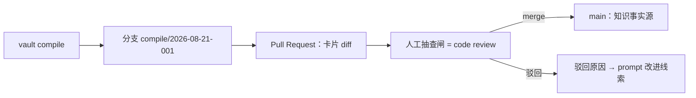

# 存储与版本化：git 原生

> 状态：设计 · 基线 2026-08-21 · Vault 联邦部分为 M5 设计（实现推迟，设计先行）
> 立场：知识库的存储层不发明任何新数据库——git 已经是最好的多人知识治理基础设施（[ADR-0003](../adr/0003-git-native-zero-infra.md)）。

## 1. 基本形态

- **一个 vault = 一个 git 仓库**（或仓库内子目录）；
- 卡片、源 meta、refs、审计记录、编译日志全部纯文本（Markdown / YAML / JSONL）；
- `_index/` 是纯生成物：永不手改，坏了就重建，重建结果可逐字节校验（`vault index --check`）。

```text
my-vault/
├─ vault.yaml              # 配置：pack、阈值、后端；（M5）依赖声明
├─ packs/
├─ sources/<id>/{meta.yaml, originals/, extracted/}
├─ cards/<kind>/*.md
├─ refs/{references.bib, status.yaml}
├─ evidence/*.jsonl
├─ _index/                 # 生成物
├─ _audit/                 # append-only
└─ _compile_log/
```

## 2. 知识变更即 PR

编译器产出以**分支 + PR** 形式提交：



收益是复用而非发明：diff 即知识变更审计、blame 即知识溯源、revert 即知识回滚、PR 讨论即裁决留痕。人类团队已有的治理工作流零成本迁移到知识治理。

## 3. CI 即治理

```yaml
# 示例：.github/workflows/vault-ci.yml 的核心步骤
- run: vault lint                 # 出处硬闸 + 结构规则，红线即失败
- run: vault index --check        # 重建索引与提交索引逐字节一致
- run: vault eval --smoke         # golden set 冒烟：命中率不低于红线
- run: vault drift --report       # suspect 占比超 5% 则警告
```

坏账本红灯，不静默腐烂。完整红线见[质量门](../governance/quality-gates.md)。

## 4. 大文件策略

- PDF 原件等二进制走 git-lfs，或放内容寻址外部目录（`vault.yaml` 配 blob 根，`sources/*/meta.yaml` 记哈希）；
- 仓库保持轻：克隆一个 vault 不应下载 GB 级原件；派生物（文本）在库内保证可离线验证 span 哈希。

## 5. Vault 联邦：知识即依赖（M5 设计，v0.2 新增）

〔真差异化候选〕当前竞距快照（2026-08）无同类设计；实现推迟到 M5，此处冻结设计意图与不变量。

### 5.1 动机

知识复用的现状是复制粘贴：团队 A 的方法库想被团队 B 用，只能 fork 或抄卡——出处链断裂，上游更新无法传播。我们把包管理器的成熟模式移植过来：**像声明包依赖一样声明知识库依赖**。

### 5.2 机制

```yaml
# vault.yaml（消费方）
deps:
  mathmodel-methods:
    git: https://github.com/acme/mathmodel-methods-vault
    rev: a1b2c3d            # 锁定到修订；不存在浮动的 latest
```

```yaml
# vault.lock（由 vault deps sync 生成）
mathmodel-methods:
  resolved_rev: a1b2c3d
  root_hash: sha256:77ee…   # 依赖库卡片树的内容哈希
```

- 跨库引用使用保留命名空间：`mathmodel-methods::card-method-gm11`（`::` 在本地 id 中禁用，M0 起即预留）；
- `VaultResolver` 端口负责把 vault-id 解析到本地缓存目录（端口 M0 定义，M5 才有 git 实现）；
- 检索联邦：`knowledge_search(scope=["self", "mathmodel-methods"])`，命中标注来源库；默认只搜本库。

### 5.3 不变量（联邦不得破坏的底线）

1. **出处链跨库仍可验证**：依赖锁定到 rev，上游卡的 span 哈希在锁定修订内可复核；
2. **上游更新不静默传播**：升级依赖 = 改 lock = 一次 PR，diff 里能看到上游知识变化对本库的影响（哪些本地卡链接到了变更卡）；
3. **治理不跨库**：只能对自己库的卡做裁决与复核；上游卡失效信号在本库表现为「依赖过期」提示，而非本库 suspect；
4. **联邦是可选层**：不声明 deps 的 vault 行为与 M0 完全一致。

### 5.4 开放问题（M5 前需回答）

- 传递依赖是否允许（A→B→C）？初步倾向：只允许一层，防依赖地狱；
- 私有库鉴权交给 git 凭据体系，CardVault 不自建；
- 上游卡被 retired 后，下游引用的降级策略。

## 6. Schema 版本化

- `spec/` 三类 schema 独立 semver（与代码版本解耦）；
- 破坏性变更必须附迁移脚本与 `vault doctor` 检测规则；
- 卡片 frontmatter 带隐式 schema 版本（缺省 = 当前主版本），迁移工具按版本逐级升级。

## 7. 与「零重基础设施」承诺的关系

| 场景 | 需要的基础设施 |
|---|---|
| M0 lint / search / read | 无（纯文件 + 进程内索引） |
| M1 编译 | 一个 LLM API key（可离线跳过编译只用已有卡） |
| M2 MCP 服务 | 本机进程 |
| M4 加速 | 单文件 SQLite（仍无服务依赖） |
| 可选向量兜底 | 唯一需要外部服务的点，且永远是可选加速器 |

数据库与向量库**永远不是事实源**：事实源始终是 git 里的纯文本。
