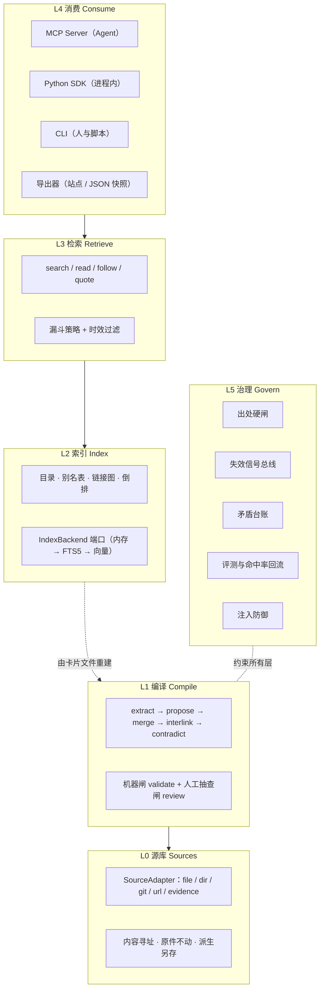
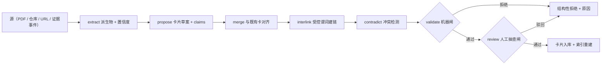
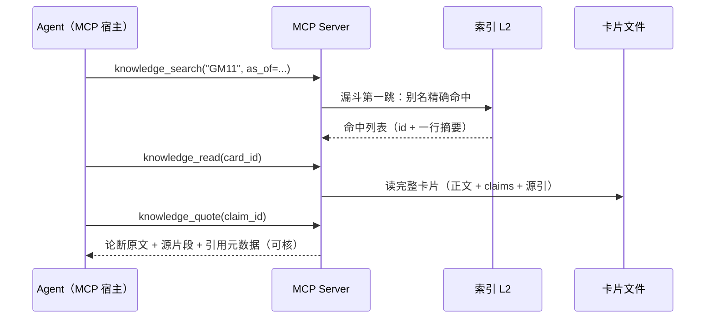
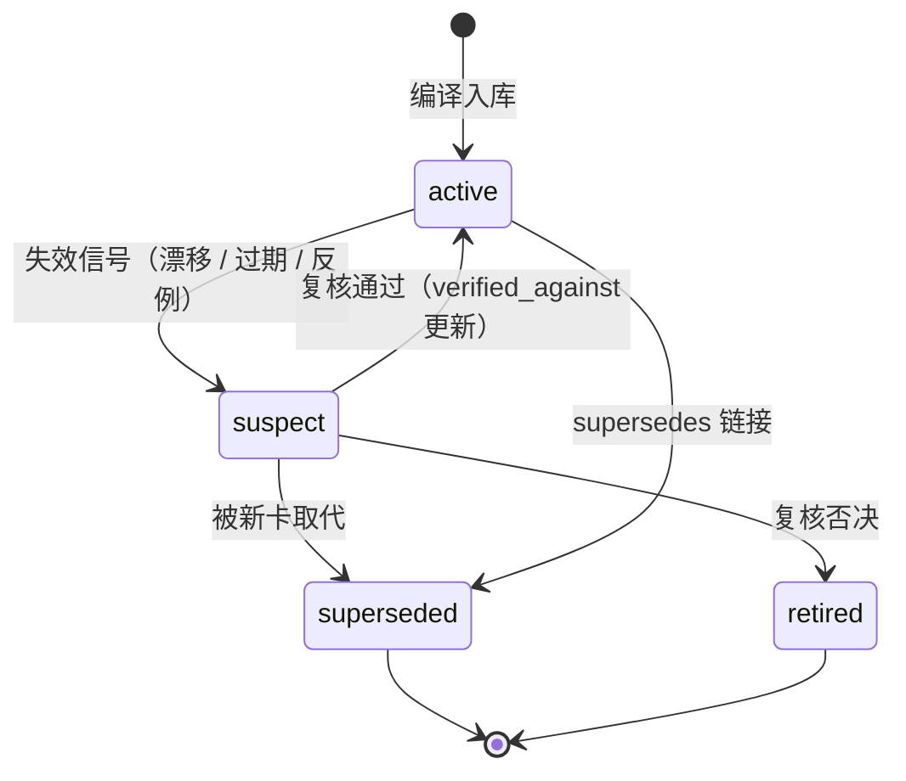
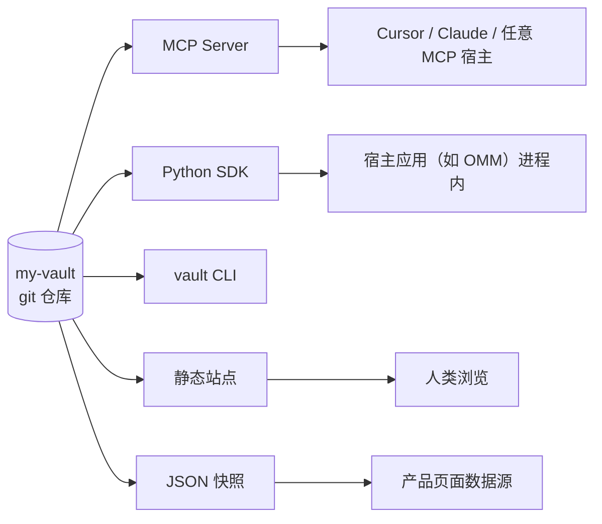

# 系统架构总览

> 状态：设计（未实现）· 基线 2026-08-21 · 设计版本 v0.2
> v0.2 相对 v0.1 内部设计稿的架构级变化：① 三条失效通道统一为**失效信号总线**（§5）；② 编译引入**可复现回放**（详见[编译管线](./compile-pipeline.md)）；③ 为 **Vault 联邦**预留命名空间与解析端口（详见[存储与版本化](./storage-and-versioning.md)）。

## 1. 设计目标（可测量定义）

| 目标 | 可测量定义 | 对应机制 |
|---|---|---|
| 可验证 | 任何论断可回溯到「源 id + 位置 + 片段哈希」，重算哈希一致 | 出处硬闸（L-PROV-*）+ span_sha256 |
| 成本可摊销 | 理解成本只在编译期付一次；检索期无原始语料进上下文 | 编译式架构 + 渐进披露检索 |
| 会进化 | 源漂移 / 时效过期 / 实战反例三类信号都能把过期知识撤出检索 | 失效信号总线 + suspect 生命周期 |
| 会自证 | 「知识库有没有用」输出为可复算指标 | 证据回流 + 贡献度度量 |
| 零重基建 | `git clone` 后不装任何服务即可 lint / search / read | 纯文件事实源 + 进程内索引 |
| 通用内核 | 内核代码与内置 schema 零领域词汇 | Ontology Pack + L-CORE-1 |

## 2. 六层架构

**分层铁律**：上层只能通过端口访问下层；任何层可单独替换实现而协议不变（例如 L2 从内存倒排换成 SQLite FTS，L3 的四工具签名与漏斗语义完全不动）。

## 3. 端口清单（六边形架构）

内核（core）定义端口，外围包提供实现，运行时装配：

| 端口 | 方法 | 语义要点 | v0 实现 → 可替换实现 |
|---|---|---|---|
| `SourceAdapter` | `resolve() / revision() / changed_since(rev) / fetch()` | `changed_since` **必须允许返回「无法判断」**——诚实优于假精确 | file / dir → git / url / evidence / 自定义 |
| `Extractor` | `extract(derivable) -> derivatives + confidence` | 抽取器名与版本入源 meta；低置信派生物不得支撑论断 | plain / pypdf → mineru / docling |
| `LlmProvider` | `propose / merge_judge / contradict_judge` | 只有 compiler 会调用；**整个 core 无 LLM 依赖** | OpenAI 兼容 / Anthropic；可离线跳过 |
| `IndexBackend` | `build(cards) / search(q) / check()` | 索引是纯生成物，`check` 校验重建一致性 | 进程内存 → SQLite FTS5 → pgvector 混合 |
| `VaultResolver`（M5 预留） | `resolve(vault_id) -> vault root` | 联邦引用 `vault::card` 的解析点 | 本地目录 → git 依赖缓存 |

## 4. 三条数据流

### 4.1 编译流：源 → 卡片

每步产物落盘可追溯；抽样率随源历史通过率自适应（新源 100% 送审，稳定源降到 10%）。细节见[编译管线](./compile-pipeline.md)。

### 4.2 消费流：查询 → 可核引用

检索永远从精确匹配开始，逐跳降级；无命中返回结构化降级信号，禁止静默回退到模型内化知识。细节见[检索协议](./retrieval-protocol.md)。

### 4.3 回流：执行证据 → 经验知识

这是 2026-08 竞距快照中全场唯一的闭环（〔真差异化〕），也是「知识库有没有用」的度量来源。机制见 [ADR-0007](../adr/0007-execution-evidence-backflow.md)。

## 5. 失效信号总线（v0.2 统一抽象）

v0.1 把「源漂移」「时效过期」「实战反例」分散在三处描述；v0.2 把它们统一为**一条总线、一个队列、一个状态机**，治理逻辑从三套变一套〔组合实践 → 架构统一〕：

| 信号生产者 | 触发 | 载荷 |
|---|---|---|
| 漂移审计 | `vault drift` 发现源 revision 变更；抽查发现 span 哈希/语义偏差 | 源 id + 受影响卡片/论断 |
| 时效过期 | `valid_until` 到期 | 论断 id |
| 执行反例 | 贡献度持续为负；失败事件直接归因 | 卡 id + 事件源 |

统一消费规则：

1. 信号只把卡置为 `suspect` 并进复核队列，**从不直接删除**；
2. `suspect` 卡默认退出检索（显式参数才可见）——知识库宁可少说话，不说过期话；
3. 每个信号与复核动作都写入 `_audit/`（append-only），可追溯谁在何时因何信号动了哪张卡；
4. 复核是人工动词（CLI），机器只能生产信号，不能自我平反。

## 6. 消费拓扑

四种形态读的是**同一份卡片文件**；导出物带「生成物勿手改」戳。治理动词（compile/drift/audit/resolve）只存在于 CLI——Agent 只读、人治理，权限边界由包依赖关系保证（mcp 包不 import compiler）。

## 7. 层可替换性矩阵

| 层 | v0 实现 | 替换点 | 替换时的不变量 |
|---|---|---|---|
| L0 | file/dir 适配器 | 新增 git/url/自定义适配器 | 四方法签名；revision 可比较 |
| L1 | 单机顺序编译 | 并行 / 远程批处理 | 七步语义与两道闸不变 |
| L2 | 进程内倒排 | SQLite FTS5 / pgvector | `vault index --check` 重建一致 |
| L3 | BM25 + 别名精确 | 加向量第四跳 | 四工具签名与漏斗顺序不变 |
| L4 | CLI + MCP | 新导出器 | 只读、同一事实源 |
| L5 | lint + CI | 组织级审计集成 | 规则清单向后兼容 |

## 8. 当前状态与差距（诚实声明）

- 本仓库当前**只有文档与 schema 草案**，无任何可运行代码；
- 六层架构、端口签名、失效总线均为设计承诺，M0 起按[路线图](../product/roadmap.md)逐里程碑兑现；
- 竞距结论带日期（2026-08），实现启动前需重核竞品进展（见[竞争格局](../product/competitive-landscape.md)）。
