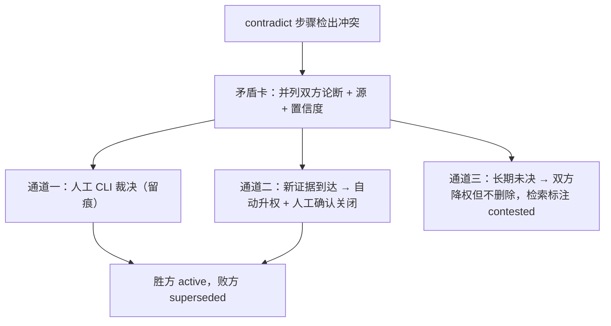

# 出处与漂移治理

> 状态：设计 · 基线 2026-08-21
> 治理的三个问题：写入的知识可信吗（出处硬闸）？入库的知识还对吗（失效信号总线）？冲突的知识听谁的（矛盾台账）？

## 1. 出处硬闸（写入校验，机器执行）

写入被拒绝**当且仅当**违反以下任一条（规则编号对应[质量门](./quality-gates.md)清单）：

| 规则 | 拒绝条件 |
|---|---|
| L-PROV-1 | claim 无 sources，或 source id 不存在 |
| L-PROV-2 | `span_sha256` 与源派生物该位置实际内容不符（引用造假或漂移） |
| L-PROV-3 | 卡片被用作出处（源链必须落到 Source） |
| L-PROV-4 | 低置信抽取（<0.6）支撑的论断未带 `low_confidence` 旗标 |
| L-REF-1 | 交付物引用了 `refs/` 之外的条目 |

三个设计要点：

1. **硬闸是 schema 级约束**，不是 prompt 里的礼貌请求——LLM 再能编，编不过校验器；
2. 哈希绑定让「引用造假」与「源已漂移」都变成机器可检出的同一类信号；
3. 拒绝带原因写回队列，编译器可修复重提——闸是流程一环，不是终点。

## 2. 失效信号总线

三类信号，一个队列，一个状态机（统一抽象详见[系统架构 §5](../architecture/system-overview.md)）：

### 2.1 漂移审计（对抗「源变了我不知道」）

- **触发式**：`vault drift` 逐源调用 `changed_since(verified_revision)`；变更源关联的全部卡片置 `suspect` 进复核队列；
- **抽查式**（对抗「转述腐烂」）：定期随机抽卡，将 claim 原文与源片段重新比对——**span 哈希 + LLM 语义核对双通道**：哈希抓「源变了」，语义核对抓「源没变但当初转述就歪了」；偏差写入 AuditRecord。

### 2.2 时效过期（对抗「时过境迁」）

`valid_until` 到期的论断自动进队列；检索侧默认已过滤，复核决定续期、修订或退役。

### 2.3 执行反例（对抗「实践打脸」）

贡献度持续为负的卡（见 §4）自动进 suspect 队列——实战证伪与源漂移同权处理。

### 2.4 统一消费规则

1. 信号只置 `suspect`，从不直接删除；
2. suspect 卡默认退出检索——**宁可少说话，不说过期话**；
3. 复核是人工 CLI 动词（`vault audit review`），机器只产信号不自我平反；
4. 全程 AuditRecord 留痕，append-only。

## 3. 矛盾台账

编译器检出不相容论断时生成矛盾卡（`contested`），**禁止自动裁决**：

**过去不被覆盖**：败方论断保留（superseded），`as_of` 查询可还原任意时点的认知——认知史是审计资产。

## 4. 评测与命中率回流

| 机制 | 内容 | 产出 |
|---|---|---|
| Golden set | 每个 vault 维护「问题 → 应命中卡」样例集，`vault eval` 输出命中率 / 首位命中率 | 检索质量红线（见质量门） |
| 检索日志回流 | 匿名化 query + 命中/未中记录 | 高频未命中 = 知识缺口清单 = 建卡待办 |
| 忠实度评测 | 抽样「消费方引用卡片生成的内容」，核对是否忠实于卡片论断 | 不忠实率红线 < 2% |
| 贡献度度量 | **引用某卡的任务成功率 vs 未引用的同类任务成功率**，按卡输出榜单 | 知识库价值的可复算证明；负贡献卡进 suspect 队列 |

贡献度度量依赖执行证据回流（[ADR-0007](../adr/0007-execution-evidence-backflow.md)）——这也是开源后最硬的宣传资产：竞品讲机制，我们讲战果数据。

## 5. 治理角色边界

| 角色 | 能做 | 不能做 |
|---|---|---|
| Agent（MCP） | search / read / follow / quote | 任何写入、任何治理动词 |
| 编译器 | 产候选卡、产失效信号、产矛盾卡 | 直接入库（必须过两道闸）、裁决矛盾、复核 suspect |
| 人（CLI / PR review） | 裁决、复核、合并、退役 | 绕过 lint 强推（CI 红线对人同样生效） |

这个边界不是文档约定，是包依赖与 CI 强制（mcp 不 import compiler；lint 挂 CI）。
