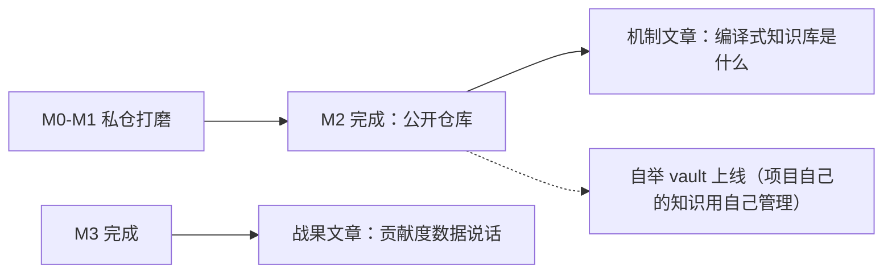

# 路线图与风险对冲

> 状态：设计 · 基线 2026-08-21 · 独立项目里程碑（不占用任何 OpenMathModel 批次）
> 原则：每个里程碑有**可测验收线**；发布节奏服务于「机制完整才见人」。

## 1. 里程碑

| 里程碑 | 内容 | 可测验收 |
|---|---|---|
| **M0 规格与骨架** | 三类 schema 冻结 v0.1；手写示例 vault（≥20 卡）；lint + index + search/read/quote/follow CLI；**全程无 LLM** | `vault lint` 0 违规；golden 20 问命中率 ≥ 0.8；陌生人按 README 10 分钟跑通 |
| **M1 编译循环** | file/dir 适配器 + plain/pypdf 抽取器 + 七步编译 + 人工审核队列 + `_compile_log` | 一份 30 页 PDF 编译出 ≥10 张有效卡；对抗样本（5 个无源论断）拦截率 100% |
| **M2 治理 + MCP** | drift / audit / resolve；矛盾卡全流程；失效信号总线；MCP Server 四工具；CI 模板；`vault init` | 修改源后 suspect 正确标记与退出检索；Cursor 实测四工具走通漏斗；**公开仓库** |
| **M3 证据回流 + 评测** | evidence 适配器 + 回流编译器 + 贡献度报表 + 忠实度评测 + 检索日志缺口清单 | 投喂 50 条模拟事件产出 ≥3 张陷阱卡过审；贡献度榜单可复算；忠实度抽样 < 2% 不忠实 |
| **M4 加速与导出** | SQLite FTS5 后端；静态站点导出器；JSON 快照导出器；10k 卡性能基线 | 10k 卡 search P95 < 200ms；站点构建 < 60s；后端切换不改四工具行为（对照测试） |
| **M5 Vault 联邦** | deps/lock 解析；`::` 跨库引用；联邦检索 scope；依赖过期提示 | 双库联邦示例可复现；升级依赖的 PR diff 正确显示影响面 |

依赖关系：M0 → M1 → M2 是最小可行核，顺序不可变；M3 与 M4 可并行；M5 依赖 M2（治理）与 M4（索引端口稳定）。

## 2. 发布与宣发策略

- **M2 即公开**：机制完整可用（编译 + 治理 + MCP）才见人，避免「又一个 RAG 玩具」的第一印象；
- **M3 后正式宣发**：拿贡献度对照数据写文章——竞品讲机制，我们讲战果；
- README 双语（EN 主 / ZH 附）+ 首屏 30 秒 demo GIF：`init → ingest 一份 PDF → compile → Cursor 里 MCP 查询`；
- 开源出色水平清单：ADR 从第一天齐全、确定性测试不依赖 LLM、CHANGELOG + semver、schema 独立版本演进、≥2 个完整示例 vault。

## 3. 风险与对冲（含放弃条件）

| 风险 | 触发指标 | 对冲 | 接受声明 |
|---|---|---|---|
| R1 编译卡片质量差 | 人工抽查驳回率 > 30% 持续两批 | 抽样率回 100%；prompt 版本化回滚（回放对照）；缩小每批语料 | 宁可编译慢，不可入库脏 |
| R2 表面积拖垮单人维护 | 单里程碑延期 > 2 倍 | M0–M2 是最小可行核；exporters / 加速后端 / M5 全部可砍 | **砍格局不砍治理**：出处闸与 lint 永不裁员 |
| R3 赛道被抢跑 | 竞品发布同等回流能力 | M2 尽早公开占位；差异守在回流 + 贡献度度量 + 联邦 | 若被完整抢先，转向做其最佳垂直实现而非硬碰 |
| R4 通用-垂直张力 | Pack 机制装不下某垂直需求 | 垂直逻辑一律进 Pack / Adapter；内核零领域词由 L-CORE-1 保证 | 内核膨胀即失败 |
| R5 编译 token 成本 | 单源编译成本超预算 2 倍 | 增量编译；两级模型（小模型初筛 + 大模型精编）；离线批处理 | 成本透明化进 `_compile_log` |
| R6 联邦复杂度失控（M5） | 传递依赖 / 鉴权需求膨胀 | 只支持一层依赖；鉴权全权交给 git 凭据体系 | 联邦是可选层，砍掉不影响单库承诺 |

## 4. 明确不做（反目标）

- 不做通用问答机器人产品（Dify 们的战场）；
- 不做自动实体图谱抽取（[ADR-0004](../adr/0004-no-auto-entity-graph.md)）；
- 不做多租户 SaaS 与权限体系（一个 vault = 一个 git 仓库）；
- 不追求全自动无人工：人工抽查闸是特性——全自动编译的质量上限就是幻觉率。

## 5. 与 OpenMathModel 的集成触发条件

1. OMM 按自身计划先落地内部薄版知识库；CardVault **M2 验收通过** 且 **OMM 评测框架就绪**后，才启动集成——二者缺一不动手；
2. 集成形态是三个薄适配层：`pack-mathmodel`（本体包）、`omm-evidence-adapter`（评测失败案例 → EvidenceEvent）、`datasets/knowledge → vault` 目录映射脚本；
3. OMM 的知识库页面快照届时改由 `vault export json` 生成——产品页面零改动。
