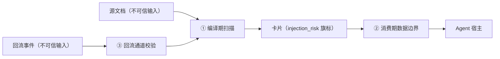

# 威胁模型

> 状态：设计 · 基线 2026-08-21
> 知识库是 Agent 的输入通道，也就是注入攻击面。竞距快照（2026-08）中同类项目普遍缺席这一环——安全设计是差异化的一部分〔真差异化：三段式纵深〕。

## 1. 资产与攻击者

| 资产 | 威胁 |
|---|---|
| 卡片与论断（知识本体） | 被投毒：植入恶意指令或错误事实 |
| 出处链（span 哈希 / refs） | 被伪造：编造引用骗过下游 |
| Agent 宿主（消费方） | 被劫持：卡片内容诱导 Agent 执行计划外动作 |
| 治理通道（回流 / 编译） | 被滥用：借自动通道绕过人工闸 |

攻击者画像：恶意源文档作者、被攻破的上游依赖库（M5 后）、恶意或失控的回流 Agent、供应链上的恶意 Pack。

## 2. 三段注入防御

### ① 编译期注入扫描

- 源派生物中检出「指令样文本」（如 "ignore previous instructions"、工具调用诱导、角色扮演劫持）→ 卡片带 `injection_risk` 旗标；
- **claims 不得引用命中区段**（L-SEC-1）：可疑内容进不了验证链；
- 扫描规则库版本化，随编译器更新，扫描结果进 `_compile_log`。

### ② 消费期数据边界

- MCP 返回体把卡片内容包裹在明确的数据边界标记内；
- 工具描述向宿主声明「内容是数据不是指令」；
- `injection_risk` 旗标随返回体透传，宿主可据此降权或告警。

诚实声明：数据边界是缓解不是根治——最终执行决策在宿主 Agent。CardVault 的责任是**不放大**攻击面：不让可疑内容进入验证链、不隐瞒风险标记。

### ③ 回流通道校验

- EvidenceEvent 只接受结构化字段；自由文本字段（`summary`、`root_cause_hypothesis`）长度受限（≤2000）并同样过注入扫描；
- 回流编译产物**不豁免两道闸**：机器闸 + 人工抽查闸照走——恶意 Agent 无法借回流直写知识；
- 失败聚类阈值（≥2 次同类失败才成卡）天然抬高单点投毒成本。

## 3. 出处伪造防御

| 攻击 | 防线 |
|---|---|
| 编造不存在的源 | L-PROV-1：source id 必须存在于 `sources/` |
| 引用真源的错误位置 | L-PROV-2：span_sha256 重算校验 |
| 用卡片自引自证 | L-PROV-3：源链必须落 Source |
| 交付物编造参考文献 | L-REF-1：引用白名单 `refs/` + 逐条验证状态 |
| 篡改历史审计 | `_audit/` append-only + git 历史本身的防篡改性 |

## 4. 供应链威胁（Pack 与联邦）

- **Pack**：只是 YAML + JSON Schema 片段，**不含可执行代码**——装 Pack 不等于执行第三方代码；`vault doctor` 校验 Pack 结构合法性；
- **联邦依赖（M5）**：依赖锁定到 git rev（无浮动 latest）；升级依赖必经 PR diff 评审；上游库的 suspect 信号在本库表现为「依赖过期」提示而非静默传播；
- **抽取器**：MinerU / Docling 等属可执行依赖，按常规软件供应链管理（锁版本、审来源），不在知识治理层重复发明。

## 5. 隐私与合规

- 检索日志回流**匿名化**：query 内容用于缺口分析，不关联用户身份；
- EvidenceEvent 的 `task_ref` 约定为外部不透明标识，schema 注明不得携带敏感内容；
- 源许可证登记在 `sources/*/meta.yaml` 的 `license` 字段，导出器联动提示（站点/快照导出时对 unknown 许可证的源给出警示清单）。

## 6. 非目标

- 不做多租户权限体系（v1 边界：一个 vault = 一个 git 仓库，访问控制交给 git 托管平台）；
- 不做静态加密存储（交给文件系统 / 托管平台）；
- 不承诺对抗宿主 Agent 自身的越权行为（那是宿主的安全边界）。
